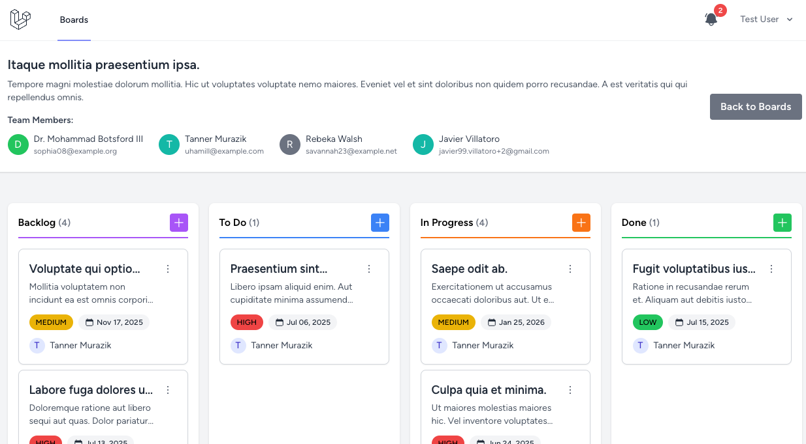

# Kanban Board

## Introduction

This project is a **Kanban-style task management system** that allows users to create and manage boards, invite other users to collaborate, and receive **real-time notifications** for task status changes and comments. The system is built with a modern stack using **Laravel 10** as the backend, **Vue 3 with Inertia.js** for the frontend, and **WebSockets (Soketi)** for real-time updates.

The goal of this project is to provide an **intuitive** and **collaborative** task management experience similar to tools like Trello or Jira but tailored for simplicity and flexibility.

Finally, this project is also to showcase the **best practices** and **modern technologies** used in building a full-stack web application, including **testing**, and **real-time notifications**.

---
### 🔗 Video Demo
[](https://www.loom.com/share/51778e032055422db62c82e9eb10c471?sid=22952d4d-552c-4830-830f-053a6068a2c5)

---

## Features

- **User Authentication** (Laravel Breeze & Sanctum)
- **Boards & Tasks Management**
  - Create, update, and delete boards
  - Invite other users to collaborate
  - Drag & Drop tasks between different statuses
  - Reorder tasks within the same status
- **Real-time Notifications** (Soketi + Laravel WebSockets)
  - Notifications for task updates and comments
  - Broadcast messages via WebSockets
- **API Endpoints** (for future integrations)
- **Drag and Drop Support** (VueDraggable)
- **Frontend & Backend Tests** (PestPHP & Playwright)
- **Database Factories & Seeders** for 

---

## Technologies Used

### Backend
- **Laravel 10** (PHP 8.3) – Full-stack backend framework
- **Laravel Breeze** – Authentication system
- **Laravel Sanctum** – API authentication
- **Laravel WebSockets (Soketi)** – Real-time communication
- **PostgreSql** – Database
- **Eloquent ORM** – Object-Relational Mapping
- **PestPHP** – Testing framework
- **Laravel Blueprint** – Code scaffolding
- **Laravel Sail** – Docker development environment

### Frontend
- **Vue 3 + Inertia.js** – Reactive UI framework
- **TailwindCSS** – Utility-first CSS framework
- **VueDraggable** – Drag & drop support
- **Heroicons** – Icon library
- **Pinia** – State management
- **Axios** – HTTP requests
- **Playwright** – End-to-end testing

### Development & DevOps
- **Docker + Laravel Sail** – Local development environment
- **Soketi** – Self-hosted WebSockets

---

## Installation & Setup

### Prerequisites
Ensure you have the following installed:
- Docker & Docker Compose (for Laravel Sail)
- Node.js & npm
- Composer (PHP dependency manager, optional)

### Clone Repository
```bash
git clone https://github.com/yourusername/kanban-board.git
cd kanban-board
```

### Install Dependencies

### Docker
```bash
docker run --rm \
    -u "$(id -u):$(id -g)" \
    -v "$(pwd):/var/www/html" \
    -w /var/www/html \
    laravelsail/php83-composer:latest \
    composer install --ignore-platform-reqs
```

#### Backend
```bash
sail php artisan key:generate
sail php artisan migrate --seed
```

#### Frontend
```bash
sail npm install
sail npm run dev
```

### Running Locally with Laravel Sail
```bash
sail up -d
```

This will start the **PostgreSql database, Soketi, and Laravel application** inside Docker containers.

### Running WebSockets
```bash
sail php artisan websockets:serve
```

### Running queue worker
```bash
sail php artisan queue:work
```

---

## Running Tests

### Backend Tests (PestPHP)
```bash
sail test
```

### Frontend Tests (Playwright)
```bash
npm run test:e2e
```

---

## Real-Time Notifications

This system uses **WebSockets (Soketi)** for real-time updates. Notifications are sent when:
1. A task changes status
2. A comment is added to a task

### Listening for Notifications (Frontend Example)
```js
window.Echo.private(`App.Models.User.${userId}`)
    .notification((notification) => {
        console.log('📩 New Notification:', notification);
    });
```

---
